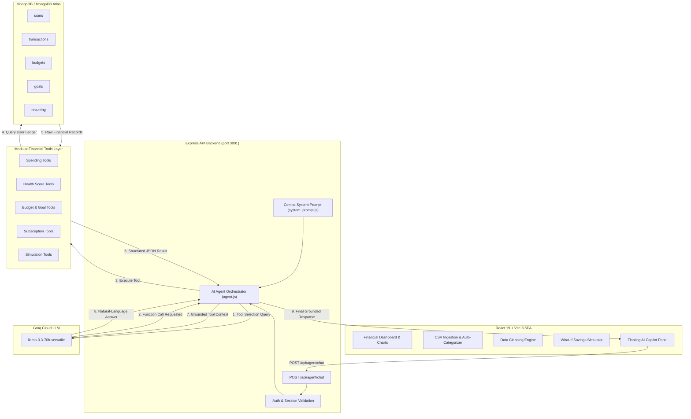

# Finova — System Architecture Diagram

---

## Architecture Components Overview

1. **React 19 Frontend**:
   - Built with Vite 8, Lucide React, and Chart.js.
   - Provides instant client-side data cleaning, manual entry, and CSV auto-mapping.
   - Houses the persistent **Floating AI Copilot** UI overlay.

2. **Express Backend API (`backend/server.js`)**:
   - Enforces user session context & multi-tenant data isolation.
   - Manages Groq API credentials safely on the backend server.
   - Dispatches incoming chat messages to the agent orchestration engine.

3. **Groq LLM Engine (`llama-3.3-70b-versatile`)**:
   - Performs sub-second function selection via official `groq-sdk` protocol.
   - Generates natural-language financial advice strictly grounded in tool calculation results.

4. **Modular Tools Layer (`backend/agent/tools/`)**:
   - 18 Groq tool definitions across spending, health scores, budget caps, goals, recurring payments, and simulations.

5. **MongoDB / MongoDB Atlas Database**:
   - Cloud MongoDB database with authenticated Mongoose schemas protecting user data.
