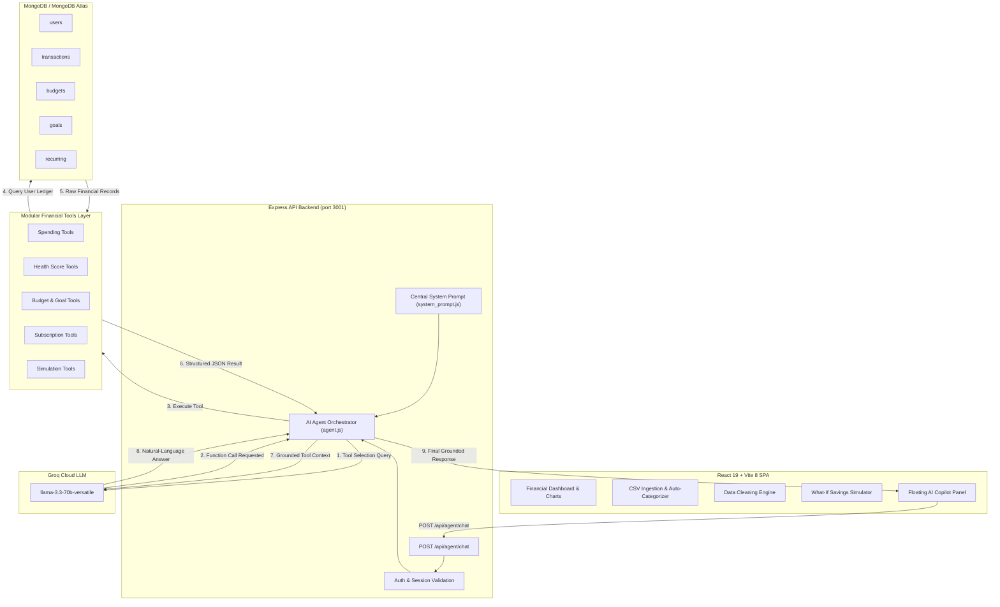

# Finova — System Architecture Diagram

> **Intelligent Financial AI Copilot** — A real-time architecture combining a React frontend with a Groq-powered AI agent backend, connected to a MongoDB database for persistent financial data analysis.

---

## System Architecture

---

## Architecture Components Overview

### 1. **React 19 Frontend** (`src/`)
   - **Framework**: Vite 8, Lucide React icons, Chart.js visualizations
   - **Key Features**:
     - Instant client-side data cleaning & normalization
     - CSV auto-mapping & transaction categorization
     - Persistent Floating AI Copilot UI overlay
     - Real-time dashboard with budget tracking & goal progress
   - **Deployment**: Vercel ([hack-in-motion-ricr-him-1018.vercel.app](https://hack-in-motion-ricr-him-1018.vercel.app))

### 2. **Express Backend API** (`backend/server.js`)
   - **Port**: 3001 (configurable via `PORT` env var)
   - **Responsibilities**:
     - User authentication & JWT session validation
     - Multi-tenant data isolation
     - Secure Groq API credential management
     - Agent orchestration & chat endpoint routing
   - **Routes**: `/api/auth`, `/api/transactions`, `/api/financial`, `/api/agent/chat`
   - **Deployment**: Render ([hackinmotion-ricr-him-1018.onrender.com](https://hackinmotion-ricr-him-1018.onrender.com))

### 3. **Groq LLM Engine** (`llama-3.3-70b-versatile`)
   - **Sub-second function selection** via official `groq-sdk` protocol
   - **Natural-language generation** strictly grounded in tool calculation results
   - **Zero hallucination guarantee** — LLM only references pre-computed financial metrics
   - **API Key**: Set via `GROQ_API_KEY` environment variable

### 4. **Modular Tools Layer** (`backend/agent/tools/`)
   - **18 Groq-compliant tool definitions**:
     - `spending_tools.js` — Monthly trends, category breakdown, merchant analysis
     - `health_tools.js` — Financial health scores, risk assessments
     - `budget_tools.js` — Budget tracking, goal alignment, savings potential
     - `subscription_tools.js` — Recurring payment analysis & optimization
     - `simulation_tools.js` — What-if scenario modeling for spending adjustments
   - **Extensible architecture** for adding new financial calculations

### 5. **MongoDB / MongoDB Atlas Database**
   - **Deployment**: Cloud MongoDB with authenticated connection string
   - **Collections**:
     - `users` — User profiles, preferences, authentication
     - `transactions` — Financial transaction ledger (CSV ingested + manual)
     - `budgets` — User-defined spending caps by category
     - `goals` — Savings goals with target amounts & deadlines
     - `recurring` — Subscription & recurring payment tracking
   - **Connection**: Mongoose ORM with schema validation & indexing

---

## Data Flow

1. **User Query** → Frontend AI Copilot panel sends message to `/api/agent/chat`
2. **Validation** → Backend validates session & user context
3. **Tool Selection** → Groq LLM analyzes query and selects appropriate tools
4. **Database Query** → Backend tools query MongoDB for user's financial records
5. **Calculation** → Tools perform structured JSON computation on ledger data
6. **Reasoning** → Groq LLM receives calculation results and generates natural language response
7. **Response** → Final grounded answer returned to frontend UI

---

## Technology Stack

| Layer | Technology | Version |
|-------|-----------|---------|
| **Frontend** | React, Vite, Chart.js, Lucide React | 19.2.8, 8.2.0, 4.5.1, 1.31.0 |
| **Backend** | Express, Node.js, MongoDB, Mongoose | 5.2.1, 20+, latest, 9.9.2 |
| **AI/LLM** | Groq SDK, llama-3.3-70b | 0.15.0+ |
| **Auth** | JWT, bcryptjs | jsonwebtoken 9.0.3 |
| **Deployment** | Vercel (FE), Render (BE), MongoDB Atlas | - |
